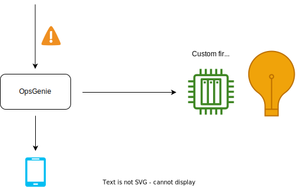
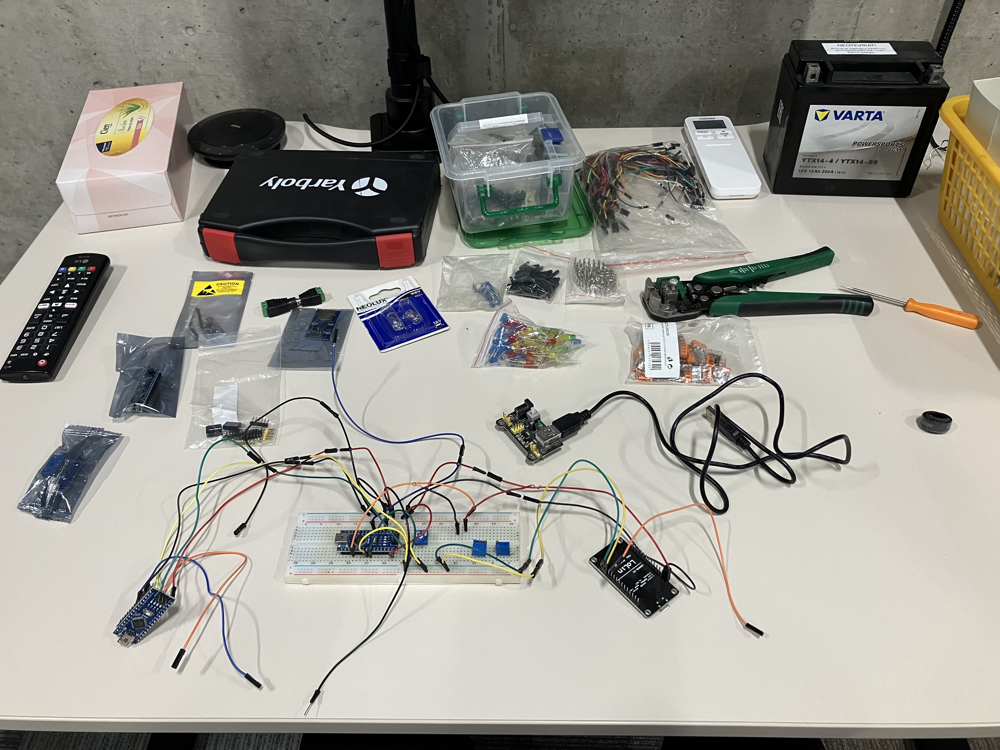
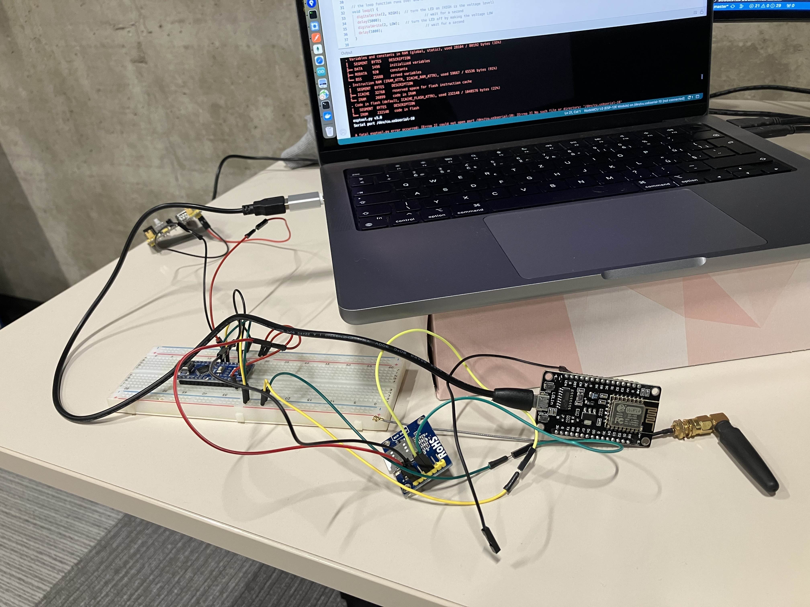
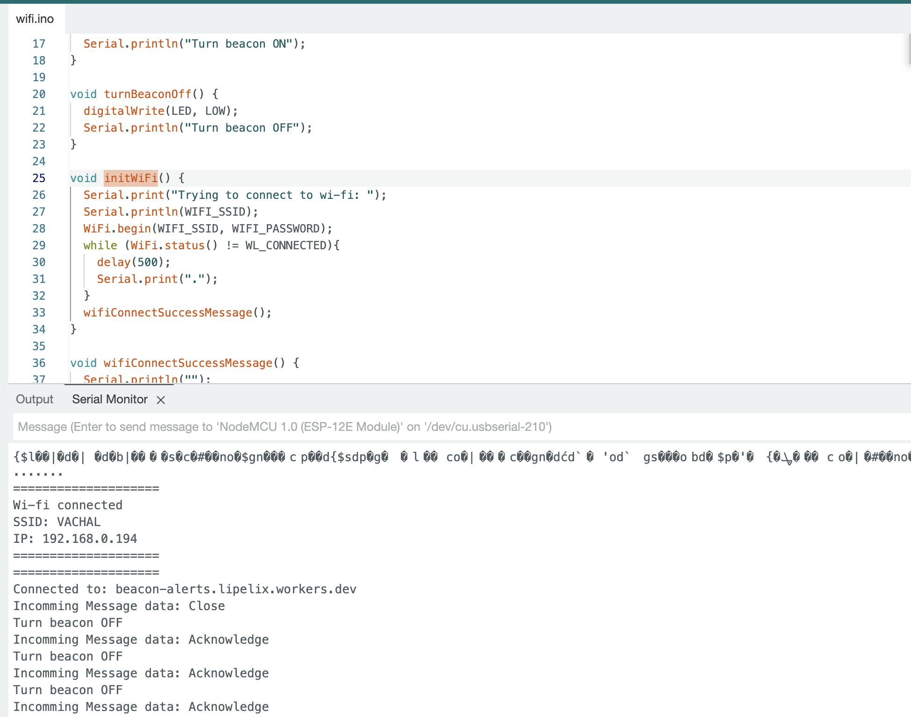
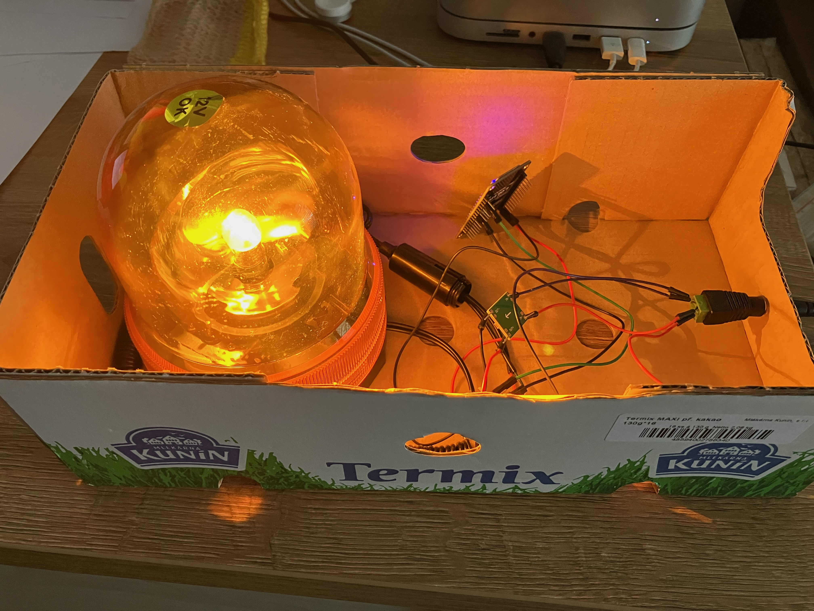
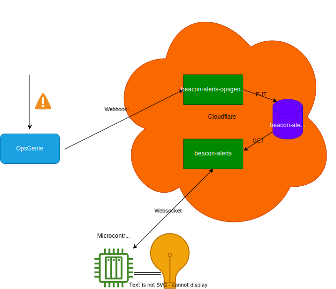
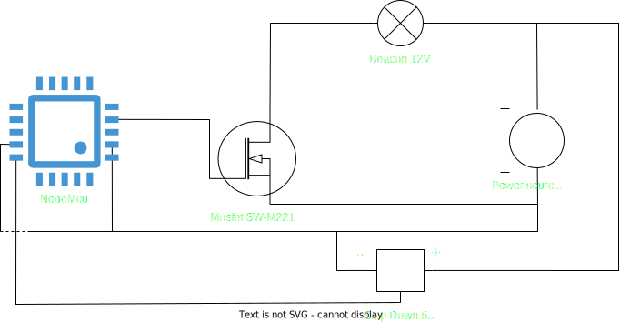

# Beacon-alerting

This project handles alerts coming from opsgenie turn on beacon placed in Pilsen offices.

> GOAL: When alert emerge, beacon start blink. It keeps blinking until alert is acknowledged.



# How to make it work?

It will consist of bunch of chapters - at first we need to create PoC and, grab all components (software and hardware) and check if it is feasible. After that we can move forward and start to figuring out how to solve power, soldering (or create custom board..) and make advanced prototype - the Alpha. At the end of Alpha it will work, but will not be beauty - that will be last part.

## 🛫 Chapter I - PoC  ![DONE]

Outcome of this chapter will be functional model with components connected on breadboard - beacon will be simulated with Light-Emitting Diode - which will react on external signal (sended through wifi or GSM) - diode will start blink.

- [ ] Decide wifi vs GSM approach
  - [x] 📶 PoC of GSM approach ![POSTPONED]
    - [ ] Create simulation (https://wokwi.com/)
    - [ ] Gather all components
    - [ ] Assemble components on breadboard
    - [ ] Kick-off firmware and upload it to board  
  - [x] 🛜 PoC of Wifi approach ![DONE]
    - [x] Create simulation (https://wokwi.com/)
    - [x] Gather all components
    - [x] Assemble components on breadboard
    - [x] Kick-off firmware and upload it to board
- [ ] Present functional prototype
- [ ] Get a beer

## 🔮 Chapter II - Alpha

Outcome of this chapter will be functional model with components connected through soldering or custom board - beacon will be real beacon - which will react on external signal (sended through wifi or GSM) from opsgenie when alert emerge.

>TBA Chapter I. could reveal something hidden - will be added

- [ ] Find hardware board creator (china?)
- [ ] Create simulation model including power
- [ ] Create integration in opsgenie
- [ ] Present functional Alpha
- [ ] Get a beer

## 🚨 Chapter III - The Beacon v1.0.0

>TBA Chapter II. could reveal something hidden - will be added

- [ ] Put all things together
  - [ ] Create 3D model which will hold all components together
  - [ ] Print/Solder/Emerge base
  - [ ] Put components together in base
- [ ] Present functional Beacon
- [ ] Get a lot of beer

---
---

# Work notes

## Micro-controllers

2 approaches how to do this:

### 1) Wifi based approach 🛜
![IN_PROGRESS]

This will need wi-fi module (is part NodeMCU). Firmware will need be connected with opsgenie through API. This should be handled by some ospgenie integration.

Then firmware will turn-on pins which will init beacon.

👍 Pros:
- one micro-controller

👎 Cons:
- need to setup wifi
- wifi has to work all the time - manage reconnection
- handling opsgenie integration

### 2) GSM based approach 📶
![POSTPONED]

This will need GSM module and main micro-controller(arduinoNano). Firmware will need to handle incomming calls or SMS from opsgenie.

Then firmware will turn-on pins which will init beacon.

👍 Pros:
- simpler communication channel with opsgenie
- GSM is everywhere wifi is not

👎 Cons:
- one micro-controller + second GSM module
- need to setup GSM (tel number, sim card)
- GSM has to work all the time - manage reconnection

# Development tools

- Firmware development, build, deploy -> https://www.arduino.cc/en/software
- Hardware modeling https://wokwi.com/arduino

# Troubleshooting

🐛 - for chinesse Arduino Nano use Board Type `Arduino Duemilanove or Diecimila`

# Progress

### `03-11-2023`
Party started 🎉

- prepared components
- created plan



---

### `01-12-2023`

Work on Chapter I. 

- GSM approach has been swith to ![POSTPONED] stated because SIM card expired 😢 https://www.mobil.cz/podpora?otazka=jak-dlouho-zustava-sim-karta-mobilcz-aktivni
- Switch focus  to Wi-fi approach
  - There are some problems with connection of Lolin esp8266 (it just blink when connect through usb serial port 😢)
  - created wokwi simulation https://wokwi.com/projects/382920450883485697
  - it is not possible to simulate incoming network traffic in free version 😢 https://docs.wokwi.com/guides/esp32-wifi#internet-access
  - there is `webhook` integration which will allow call url (exposed by wi-fi module) from ops-genie https://heureka.app.opsgenie.com/teams/dashboard/454e0517-88ca-4aa4-b481-a0996c263794/integrations/webhook/53878d00-3572-45da-a83a-077d9bbf4a9b



---

### `31-01-2024`

Work on Chapter I. 

- Create outgoing integration from OpsGenie to webhook
  - tested that when alert is fired, webhook is called
  - using `ngrok` tool https://dashboard.ngrok.com/cloud-edge/endpoints
  - create playground-app and add webhook payload examples for `create`,`acknowledge`,`unacknowledge`,`closed` events
```
curl --location --request POST 'https://turtle-hip-endlessly.ngrok-free.app/' --header 'ngrok-skip-browser-warning: 1'
```

---

### `21-02-2024`

Work on Chapter I. 

- Integration between micro-controller and cloudflare worker
  - create integration with websockets micro-controller is client cloudflare worker server
  - `beacon-alerting/wi-fi/wifi/wifi.ino` - receive messages from cf worker
  - adjust playground-app and add webhook integration `beacon-alerting/playground-app/index.html`
  - cf worker runs on `https://beacon-alerts.lipelix.workers.dev/`



### `20-03-2024`

---

Work on Chapter I. 

- Get components together on breadboard
  - 😿 Find out that Nodemcu do not deliver enough power to turn on relay (only 40mA but relay needs 120mA)
  - Need to use mosfet instead of relay - https://dratek.cz/arduino/1754-pwm-15a-400w-mosfet.html
- Firmware development
  - 🎉 Correctly setup pins and ON/OFF states in `wifi.ino`
- Integration between micro-controller and cloudflare worker


### `01-04-2024`

---

🎉 Finalize Chapter I. 
- Get components together on "Mlekarna kunin" base
  - solder jumpers on mosfet
  - connect all components together
- Firmware development
  - Use only ON/OFF states instead of full action description to simplify thing `wifi.ino`
- Create integration between micro-controller and cloudflare worker
  - Deploy both workers
    - `beacon-alerts.lipelix.workers.dev` - server which sends status of beacon to micro-controller
    - `beacon-alerts-client.lipelix.workers.dev` - client which receives alerts from ospgenie and change state in KV store





# Used components
- Arduino Nano: https://dratek.cz/arduino/823-arduino-nano-v3.0-atmega328-precizni-klon.html
- Lolin Nodemcu Esp8266 https://dratek.cz/arduino/122953-lua-nodemcu-esp8266-v3-wifi-modul.html
> TBA


<!-- Metadata -->

<!-- Image links -->
[IN_PROGRESS]: https://img.shields.io/badge/IN_PROGRESS-green.svg
[DONE]: https://img.shields.io/badge/DONE-purple.svg
[WONT_DO]: https://img.shields.io/badge/WONT_DO-inactive.svg
[POSTPONED]: https://img.shields.io/badge/POSTPONED-inactive.svg
[TODO]: https://img.shields.io/badge/TODO-blue.svg